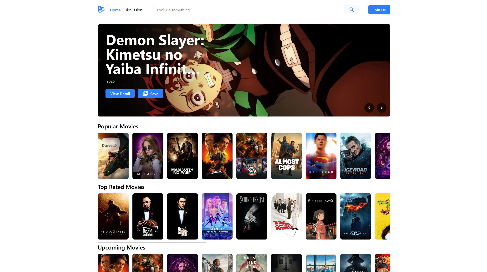
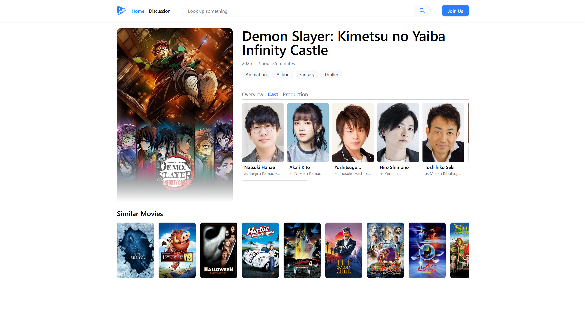
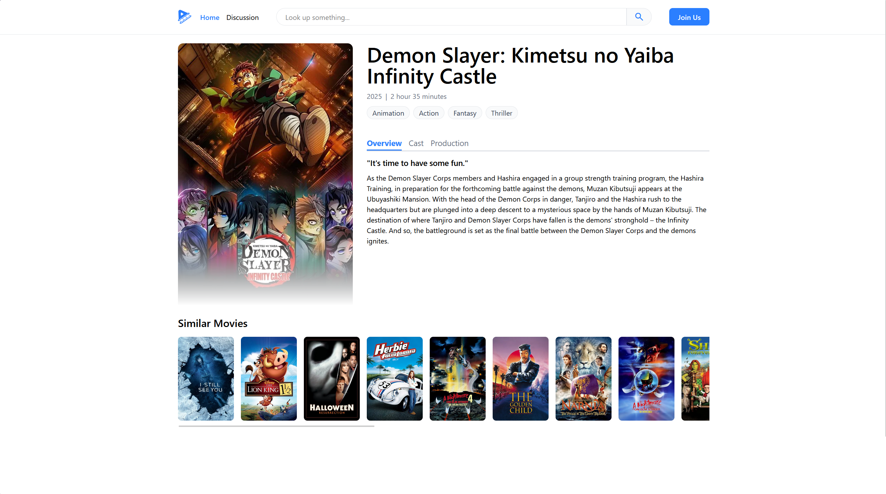
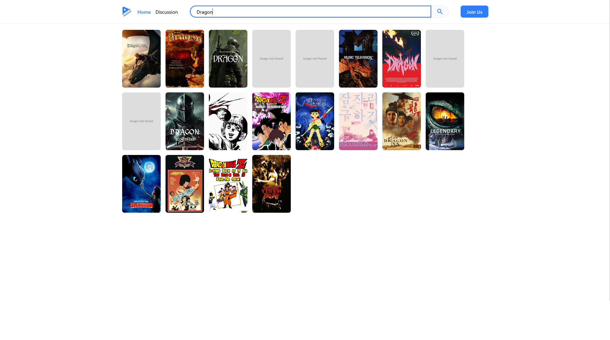

# FilmLog - A Modern Movie Discovery App

This project is a responsive and feature-rich movie discovery web application built with modern web technologies. It allows users to browse, search, and view details about movies, leveraging The Movie Database (TMDB) API for its data.

## ScreenShots

### Homescreen


### Cast Detail


### Movie Detail


### Search Results


## Features

- **Movie Discovery**: Browse lists of popular, top-rated, and upcoming movies.
- **Trending Carousel**: A dynamic hero carousel on the homepage showcases trending movies.
- **Advanced Search**: Users can search for movies by title, with results displayed in a clean grid layout.
- **Detailed Movie Information**: Clicking on any movie reveals a detailed view including:
  - Poster, title, release year, and runtime.
  - Genres, tagline, and a full overview.
  - A tabbed interface to view the main cast and the production companies.
- **Similar Movies**: The detail page also suggests a list of similar movies.
- **Responsive Design**: The UI is fully responsive and works seamlessly on devices of all sizes.
- **Skeleton Loading Screens**: To enhance user experience, custom skeleton screens are displayed while content is being fetched, providing a smooth and professional feel.
- **Robust Error Handling**: The application gracefully handles API errors and displays user-friendly messages.

## Technologies Used

- **React**: The core of the application is built using the React library for creating dynamic user interfaces.
- **Vite**: Serves as the lightning-fast build tool and development server.
- **React Router DOM**: Handles all client-side routing, enabling a seamless single-page application (SPA) experience.
- **Tailwind CSS**: Used for all styling, providing a utility-first approach for rapid and consistent UI development.

## Project Setup

Follow these steps to get the project running on your local machine.

### Prerequisites

- Node.js (v18 or newer recommended)
- npm or a compatible package manager
- A TMDB API Key

### Installation

1.  **Clone the repository:**
    ```bash
    git clone <your-repository-url>
    cd frontend
    ```

2.  **Install dependencies:**
    ```bash
    npm install
    ```

3.  **Set up your API Key:**
    This project requires an API key from The Movie Database (TMDB). You can get one for free by creating an account at [themoviedb.org](https://www.themoviedb.org/).

    Once you have your key, create a new file named `.env` in the root of the `frontend` directory and add your key to it like so:

    ```
    VITE_THEMOVIEDB_API_KEY=your_api_key_here
    ```

4.  **Run the development server:**
    ```bash
    npm run dev
    ```

    The application should now be running on `http://localhost:5173` (or the next available port).

## Available Scripts

In the project directory, you can run:

- `npm run dev`: Runs the app in development mode.
- `npm run build`: Builds the app for production to the `dist` folder.
- `npm run lint`: Lints the code to find and fix problems.
- `npm run preview`: Serves the production build locally to preview it.